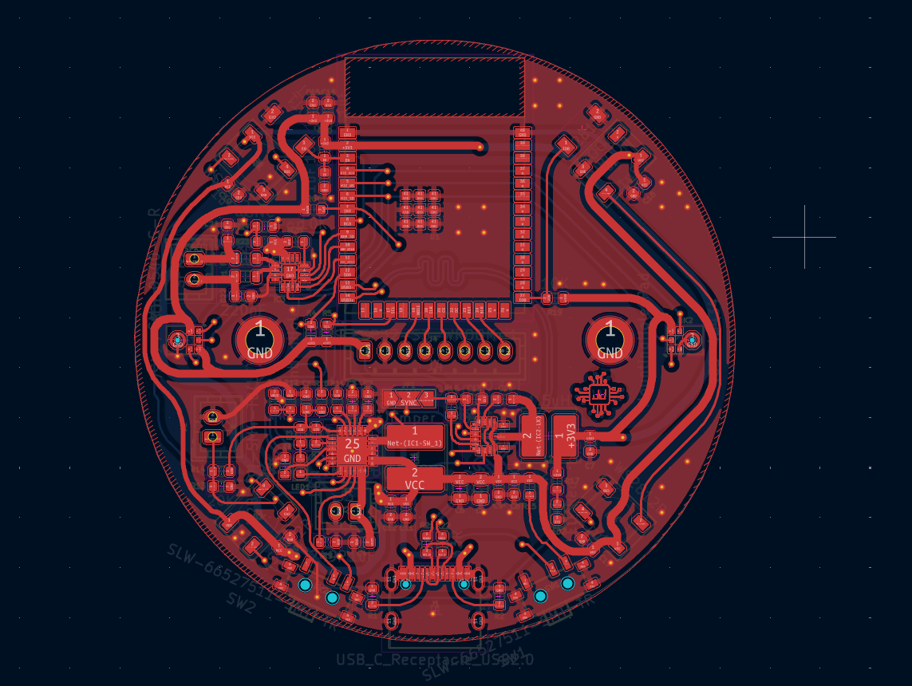
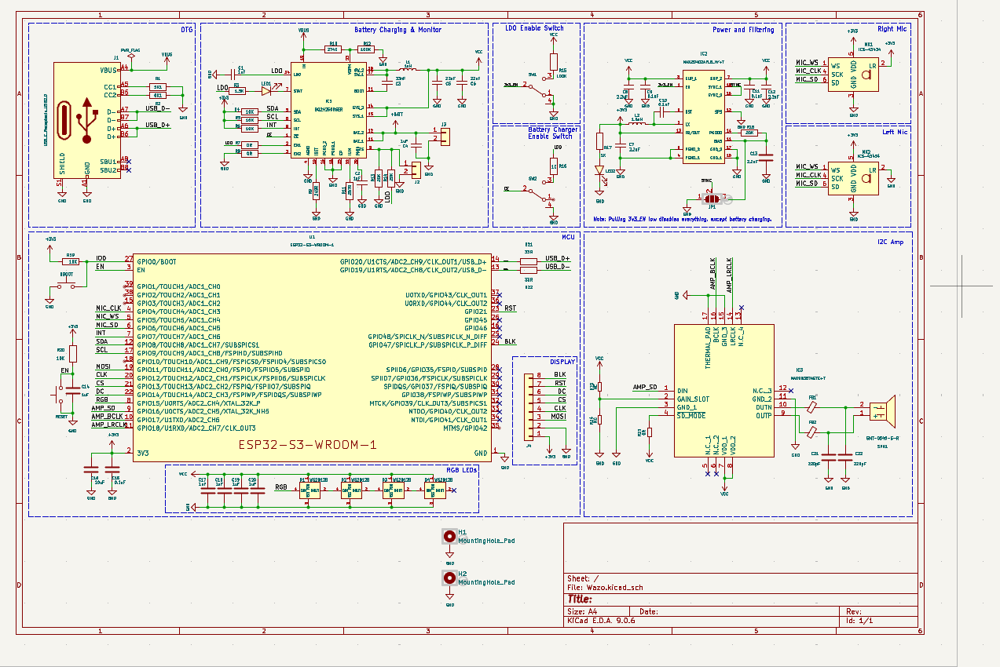
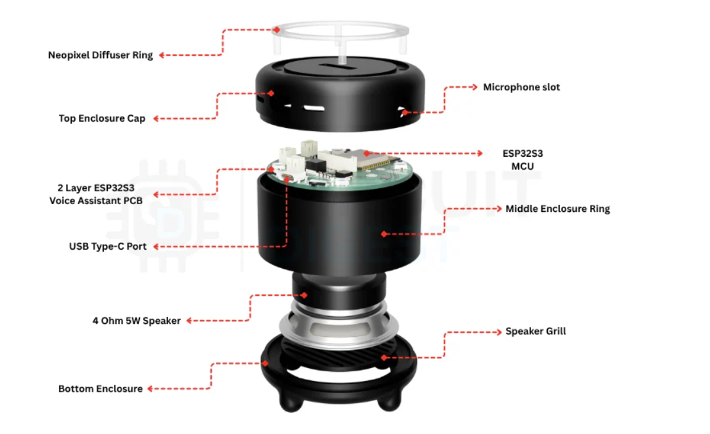
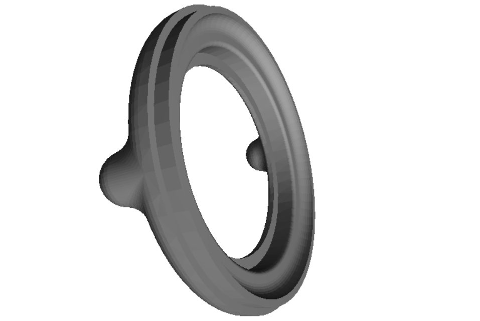
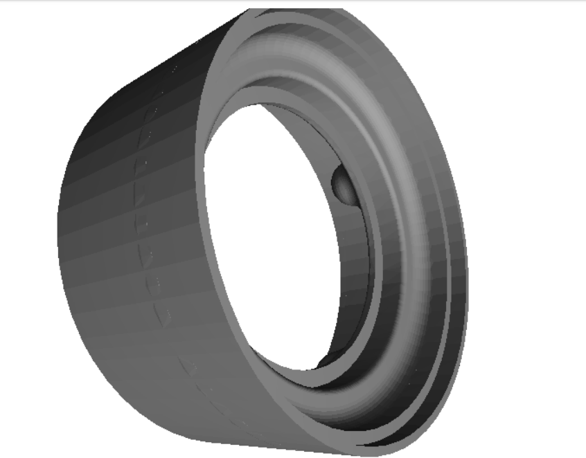
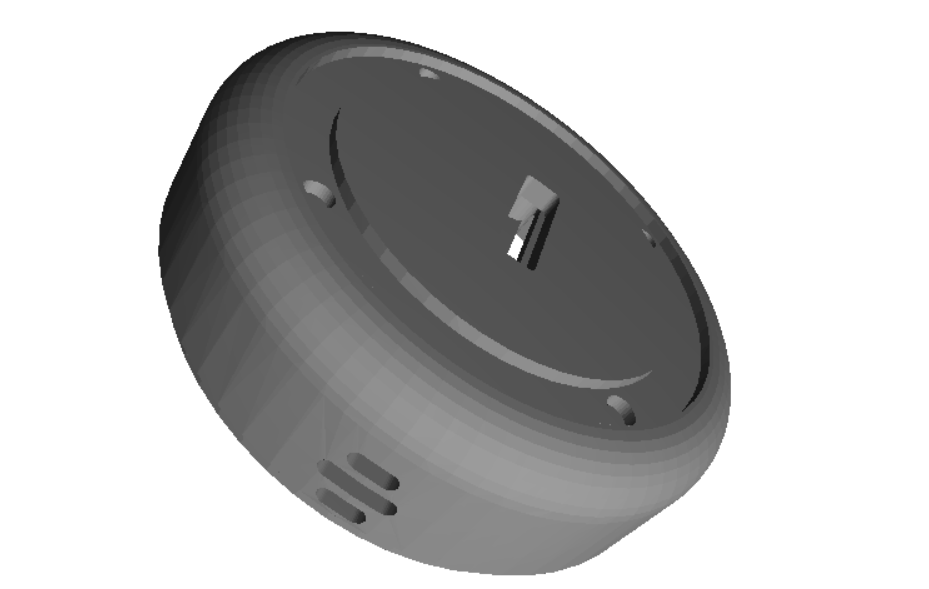
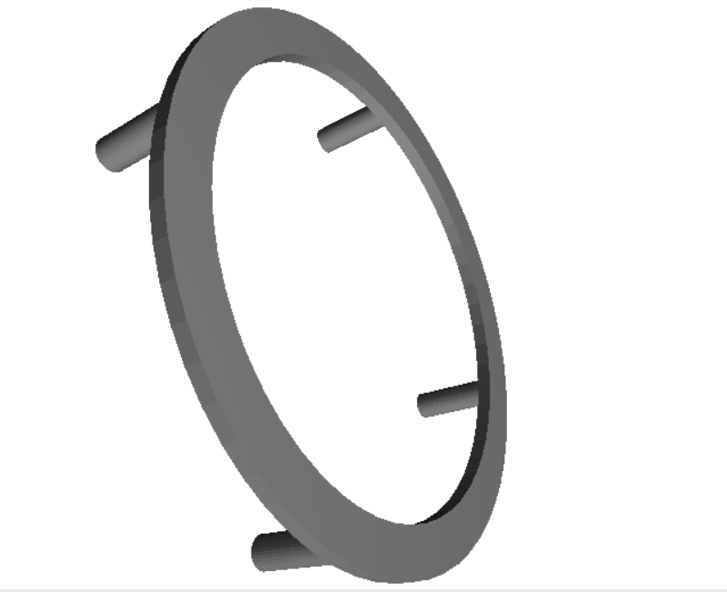
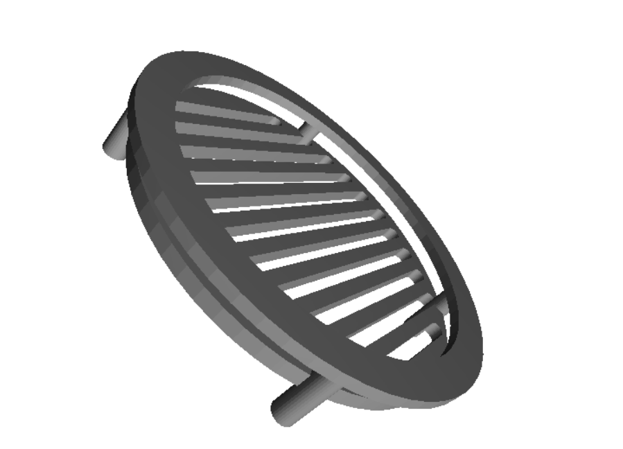

# Wazo

> Voice assistant that actually understands Nigerian languages. Runs on local hardware, not the cloud.

Wazo (Yoruba for "wisdom") is a voice assistant built for Nigeria's 200+ million people who speak Yoruba, Igbo, Hausa, and Pidgin. Unlike Siri or Alexa, everything runs locally on a Raspberry Pi in your home - no internet required, no cloud servers, complete privacy.

## Why This Exists

Try asking Alexa something in Pidgin. Or with a Nigerian accent. Doesn't work, right?

Global tech companies train their voice assistants on American and British English. They don't understand our accents, can't speak our languages, and definitely don't get our cultural context. Plus they need constant internet (good luck with that in Nigeria) and die during power outages.

So we're building something different:

- **Local AI processing** - Raspberry Pi 4 does all the work, no cloud needed
- **Nigerian-trained models** - Whisper fine-tuned on actual Nigerian speech
- **Battery backup** - Works through NEPA outages
- **Privacy first** - Your voice data never leaves your house
- **Open source** - MIT license, fork it and make it yours

## How It Works

**Hardware:**
- ESP32-S3 devices scattered around your house (microphones + speakers + LEDs)
- Raspberry Pi 4 as the "brain" running all the AI models
- Everything talks over WebSocket (local network only)

**Software Stack:**
- **Speech-to-Text**: OpenAI Whisper fine-tuned on Nigerian accents
- **Brain**: Llama-3 or Mistral running via Ollama
- **Text-to-Speech**: Coqui TTS with Nigerian voice models
- **Communication**: MCP protocol for device control

---

## Project Status & Roadmap

### Phase 1: Hardware Foundation 
- ESP32-S3 PCB design (adapted from Xiaozhi)
- Dual microphone I²S array
- Battery management system
- 3D-printed enclosure
- MCP protocol implementation

### Phase 2: Nigerian AI Models
- Fine-tune Whisper on Nigerian Pidgin
- Collect 100+ hours Nigerian voice samples
- Train Yorùbá wake word models
- Test tonal recognition accuracy
- Develop Nigerian cultural context prompts

### Phase 3: Raspberry Pi Server 
- Build WebSocket server architecture
- Integrate Ollama + Whisper + Coqui
- Implement MCP device discovery
- Create Nigerian smart home tools
- Deploy in test households

### Phase 4: Community Testing
- Deploy 10 units in Lagos/Ibadan/Kano
- Gather user feedback from Nigerian users
- Iterate based on real-world Nigerian usage
- Expand language support based on demand

---

## Current Status

**What works:**
- Hardware design (adapted from the excellent Xiaozhi ESP32 project)
- Basic firmware and audio processing
- MCP protocol communication

**What's in progress:**
- Training Whisper on Nigerian Pidgin speech
- Collecting voice samples from Nigerian speakers
- Building the Raspberry Pi server software

**What's next:**
- Wake word detection for Nigerian languages (starting with Pidgin)
- Tonal language support for Yoruba
- Deploy test units in Lagos and Ibadan
- Field testing in Nigerian households

---

## Hardware Design

The hardware is split into two parts: the PCB (circuit board) and the enclosure (3D-printed case).

#### PCB Design


*60mm x 60mm PCB with ESP32-S3, dual microphones, battery management, and audio amplifier*


*Full circuit schematic showing power, audio, and communication systems*

**Design Files** in [`Hardware/PCB/`](Hardware/PCB/):
- `KiCAD_files/` - Editable KiCAD project files (schematic + PCB layout)
- `Gerber/` - Manufacturing files ready for JLCPCB/PCBWay (~$15 for 5 boards)
- `BOM/` - Complete parts list in Excel and PDF
- `Schematics/` - PDF versions of the circuit design

#### 3D Enclosure Design


*Complete assembly showing how all parts fit together*

<details>
<summary><b>Click to see individual enclosure parts</b></summary>


*Bottom enclosure - houses battery and PCB*


*Middle ring - speaker mount and ventilation*


*Top cap with microphone openings*


*LED diffuser ring for status indicators*


*Speaker protection grill*

</details>

**STL Files** in [`Hardware/CAD/`](Hardware/CAD/):
- Ready to print on any FDM 3D printer (tested with PLA/PETG)
- Designed for tropical climate with ventilation slots
- Print time: ~18 hours total for full set

---
## Project Structure

```
WAZO/
├── Hardware/           # Physical device design
│   ├── PCB/           # Circuit board files
│   │   ├── images/    # PCB renderings (see README)
│   │   ├── KiCAD_files/ # Editable design files
│   │   ├── Gerber/    # Manufacturing files for PCB fab
│   │   ├── BOM/       # Bill of materials (parts list)
│   │   └── Schematics/ # Circuit diagrams (PDF)
│   └── CAD/           # 3D enclosure design
│       ├── images/    # Enclosure renderings
│       └── *.STL      # 3D printable parts
│
├── main/              # ESP32 firmware source code
│   ├── audio/         # Microphone & speaker handling
│   ├── boards/        # Support for 80+ ESP32 boards
│   ├── display/       # Optional screen support
│   └── protocols/     # MCP communication layer
│
├── server/            # Raspberry Pi AI server (WIP)
│   ├── whisper/       # Speech-to-text service
│   ├── ollama/        # LLM inference
│   └── tts/           # Text-to-speech engine
│
├── docs/              # Documentation & guides
└── scripts/           # Build & deployment tools
```

---

## Hardware Specs

The ESP32-S3 design is adapted from the [Xiaozhi project](https://github.com/78/xiaozhi-esp32) (huge thanks to them). We've modified it for Nigerian conditions:

- **Microcontroller:** ESP32-S3-WROOM-1 (16MB Flash, 8MB PSRAM)
- **Audio Input:** Dual ICS-43434 I²S MEMS microphones
- **Audio Output:** MAX98357A I²S amplifier + 3W speaker
- **Power:** BQ24250 Li-Ion charger, MAX20402 buck-boost, 5000mAh battery
- **Indicators:** WS2812B RGB LED ring
- **Connectivity:** WiFi 802.11 b/g/n (local network only)

**Nigerian Adaptations:**
- 5000mAh battery instead of 2000mAh (NEPA power outages)
- Enhanced ventilation for tropical climate
- Solar charging option (experimental)

**Cost per unit:** ~$40 for ESP32 device, ~$55 for Raspberry Pi 4 server (handles multiple rooms)

---

## License & Attribution

### Wazo License
This project is licensed under the **MIT License** - see [LICENSE](LICENSE) file for details.

### 🙏 Attribution & Acknowledgments

**Wazo builds upon excellent open-source work:**

#### Hardware & Firmware Base
- **[Xiaozhi ESP32 Project](https://github.com/78/xiaozhi-esp32)** (MIT License)
  - ESP32-S3 firmware foundation
  - MCP protocol implementation
  - Audio processing pipeline
  - Hardware PCB design base

---

## Nigerian Languages

Right now we're focusing on Nigerian Pidgin and Nigerian English. Yoruba, Igbo, and Hausa are coming next.

The tricky part with Yoruba is the tones - same word with different pitch means completely different things (igbá = garden, ìgbà = time, igba = calabash). We're working on training models that understand this.

*Building technology that speaks our language, not the other way around.*